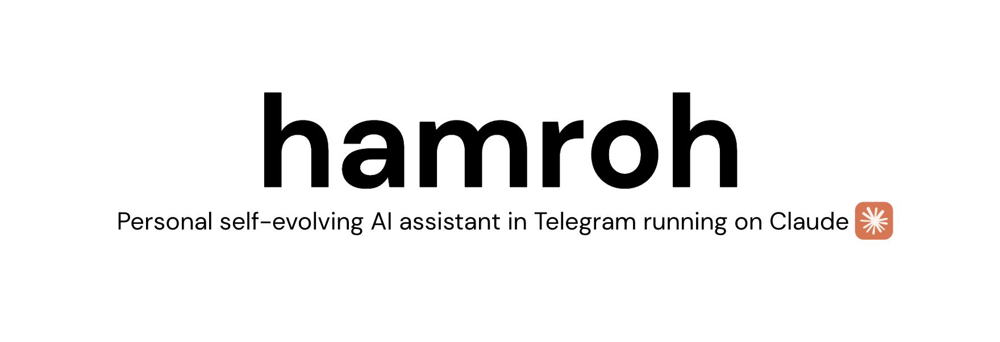

<p align="center">
  
</p>

<p align="center">
  <b>hamroh</b> is a framework for running your own persistent AI companion on Telegram — one you fully own, control, can extend, one that learns from you.
</p>

---

> **Try it live:** a running instance lives in the [@rustamz_workshop](https://t.me/rustamz_workshop) Telegram group — join and message Luna, assistant running on top of hamroh, to see it in action before you install.

**hamroh** runs a persistent AI assistant in your Telegram. Not a chatbot — an agent that has memory, runs scheduled tasks, can monitor things, and can be extended with any tool you wire up.

You own everything: the memory files, the skill playbooks, the MCP connections, the logs, the tokens. Nothing is routed through a third-party product. You can read every decision it made and change any rule from a DM.

Out of the box it:
- Stays in your group chat and joins conversations when it has something useful to say
- Runs *self-reflection* — reviews what it got wrong and proposes new rules for your approval
- Executes scheduled research tasks in background subagents while staying responsive to messages
- Remembers context across restarts via file-based memory

It is extendable: add MCPs to connect it to anything: GitHub, Jira, email, calendar, your own APIs. Add skills, build custom tools.

Runs on a laptop or small VPS.

The goal is a [Jarvis](https://www.youtube.com/watch?v=Qav7NJIsKL4&t=2s) — an AI that lives with you, monitors what matters, and acts on your behalf. hamroh is the foundation.

## Quickstart (3 minutes)

If you don't know where to run, I recommend [Hetzner](https://www.hetzner.com/cloud/) or [Contabo](https://contabo.com/en/vps/).
 
Pre-requisite: 
* Install Docker compose
* Install the Claude Code CLI
* Generate a Claude auth token on your machine: `claude setup-token` (opens a browser; works with a Claude subscription or API). It prints a token starting with `sk-ant-oat01-…` — you'll paste it into `.env` below. This is the login for the bot on every OS (Linux, macOS, Windows).

**Instructions for running on Linux**
```bash
git clone https://github.com/Rustam-Z/hamroh && cd hamroh

cp .env.example .env && nano .env
#   set TELEGRAM_BOT_TOKEN  (create a bot in @BotFather and copy its token here)
#   set HAMROH_OWNER_ID  (your numeric Telegram user id, from @userinfobot)
#   set CLAUDE_CODE_OAUTH_TOKEN  (run `claude setup-token`, paste the sk-ant-oat01-… token)
#   update if necessary: HAMROH_MODEL and HAMROH_EFFORT

cp access.json.example access.json
#   give access to extra DMs and groups, you can use /access and /deny commands after bot started to update the list

cp plugins.json.example plugins.json && nano plugins.json
#   single source of truth for the bot's capability surface — see below

cp prompts/project.md.example prompts/project.md && nano prompts/project.md
#   set bot name, language, personality

docker compose up -d --build                                              # build and run, wait for "hamroh is live"
docker compose logs -f                                                    # [optional] monitor logs
docker compose exec hamroh python -m hamroh.scripts.trace --follow  # [optional] monitor Claude Code I/O logs
```

DM your bot. It replies.
 
### No docker?

You need Python 3.11+ and the Claude Code CLI (`claude --version`).

```bash
uv sync --extra dev
uv run python -m hamroh                                               # run, wait for "hamroh is live"
uv run python -m hamroh.scripts.trace --follow                        # [optional] monitor, Claude Code I/O logs
```

## Configuration

> **This README is the high-level intro.** Deeper material lives in
> [docs/](docs/) — full technical manual, deployment walkthrough, tools
> reference, and the systems hamroh descends from. Start at
> [docs/README.md](docs/README.md).

Out of the box: messaging, memory, reminders, web, vision. Want shell access? Code editing? Plug in any other MCP server — GitHub, Jira, Notion, Slack, your own — same one-entry pattern, stdio or remote HTTP/SSE with auth headers.

### Customization

Beyond the config files, you extend the bot by dropping in files — no Python needed for most:

- **Skills** — add a playbook at `skills/<name>/SKILL.md`; the bot reads it on its own initiative. [docs](docs/documentation.md#agent-skills)
- **MCPs & tools** — capability surface, what tools, skills, and MCPs are on `plugins.json` (`stdio` or remote HTTP/SSE), with credentials pulled from `.env` via `${VAR}`. Read [docs/tools.md](docs/tools.md). [docs/documentation.md](docs/documentation.md#what-pluginsjson-controls).
- **Reminders** — custom recurring reminders shipped with the bot are at `default-reminders.json`. [docs](docs/documentation.md#custom-reminders-default-remindersjson).
- **Memory notes** — the bot's notes live under `memories/` (e.g. `memories/notes/references.md`); the bot reads, searches, and writes them, and you can curate them too. Addressed by full path (`memories/...`) and git-tracked, so memories survive restarts and you can commit them. [memories/README.md](memories/README.md)
- **Persona & rules** — extend the system prompt by editing `prompts/project.md`; it's appended to the shipped `prompts/system.md`. [docs](docs/documentation.md#system-prompt). Bot name, language, house rules, owner-specific instructions; appended to the shipped `prompts/system.md`.
- **Access** — who can DM the bot or use it in groups (hot-reloaded, no restart). [docs/documentation.md](docs/documentation.md#access-control).
- `.env` secrets — Telegram bot token, owner id, plus any credentials your `plugins.json` entries reference via `${VAR}` (the example file's GitLab / GitHub entries demonstrate the pattern).

Read more in [docs/documentation.md](docs/documentation.md#run-your-own-agent).

### Telegram @BotFather configs

- Disable "Allow groups" if you don't want others to add bot in groups. 
- Enable "Bot to bot communication" so that bot can see other bot's messages.

## What hamroh can do

A quick tour — the full per-tool surface (args, limits, rails) is in [docs/tools.md](docs/tools.md).

- **Communication & media:** send / reply / edit / delete, reactions, polls; render HTML and LaTeX to PNG; read inbound photos (vision), text-like docs, and PDFs.
- **Memory:** persistent markdown addressed by full path (list / search / read / write / append), 64 KiB/file, read-before-write, survives restarts. One store: a **git-tracked** `memories/...` folder the bot reads, searches, writes, and appends to — and that you can commit and curate. See [`memories/README.md`](memories/README.md).
- **Search & history:** web search / fetch (no internal URLs) and read-only SQL SELECTs on the chat database.
- **Browser:** drives a real headless Chromium for pages `WebFetch` can't reach — navigate, click, fill, read, screenshot, download. On by default.
- **Scheduling:** one-shot + cron reminders, plus git-tracked custom reminders in `default-reminders.json`. Daily self-reflection (on by default) that proposes durable rules for your approval.
- **Skills & self-edit:** operator-curated playbooks under `skills/`; the bot can append rules to `prompts/project.md` (owner-only).
- **Opt-in:** shell, code editing, and subagents — all off by default, toggled in `plugins.json`. Plug in any external MCP server the same way.
- **Can't:** generate images; send/read voice, video, stickers, GIFs; moderate groups; make calls.

## Architecture

```
Telegram  →  Engine (buffer + debounce)  →  Claude worker  →  claude process
                       │                                            │
                       ▼                                            ▼
                    SQLite                                   Local MCP server
```

- **Telegram listener** reads messages, saves them to SQLite, hands
  them off.
- **Engine** bundles messages that arrive close together. If a new
  one arrives while Claude is mid-reply, it's injected into the
  running turn.
- **Claude worker** runs the `claude` subprocess and restarts it on
  crash.
- **MCP server** auto-loads every tool in
  [hamroh/tools/](hamroh/tools/).

The engine handles **one turn at a time**. A long task in chat A
delays chat B until it finishes. Fine for one user; for busy setups,
run a separate bot per chat group.

The system prompt is two files: [prompts/system.md](prompts/system.md)
(generic hamroh behaviour, shipped) and `prompts/project.md`
(your overlay — gitignored, copy from
[prompts/project.md.example](prompts/project.md.example)).

## Security

The bot is public-facing and the security model is enforced in code, not by hope — see [Security model](docs/documentation.md#security-model) for the full list of rails and [docs/tools.md](docs/tools.md) for the per-tool surface.

## Contributing

Issues and PRs welcome.

Architecture deep-dive before bigger changes: [docs/documentation.md](docs/documentation.md).

## License

MIT. See [LICENSE](LICENSE).
